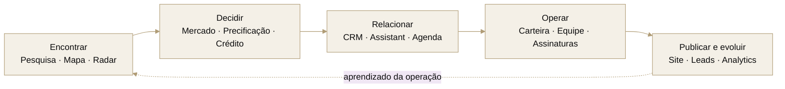
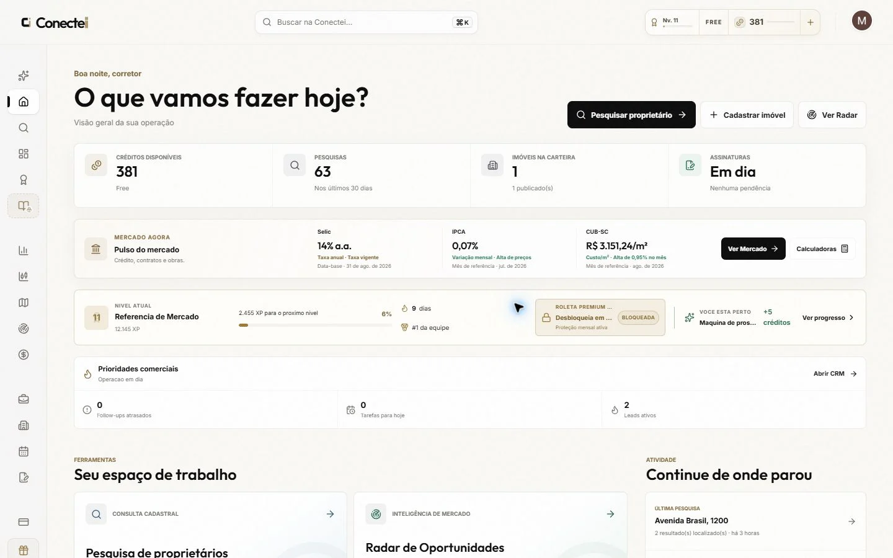
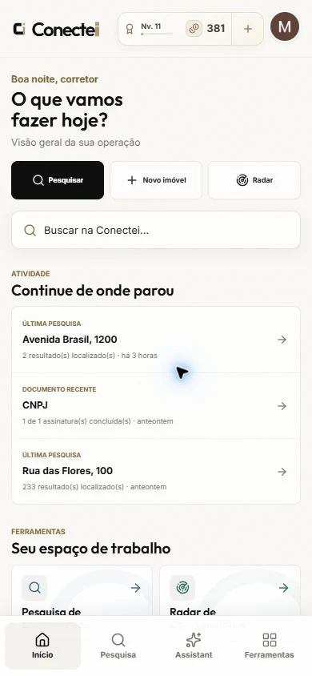
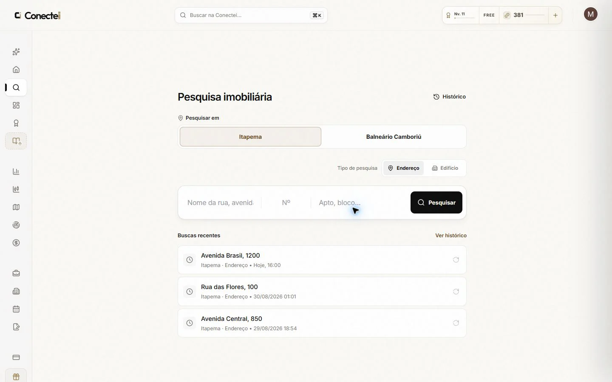
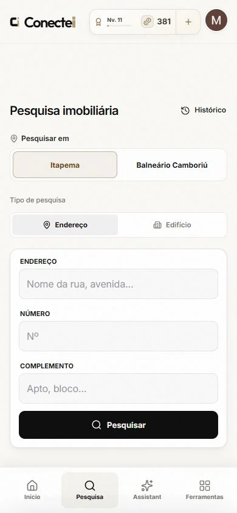
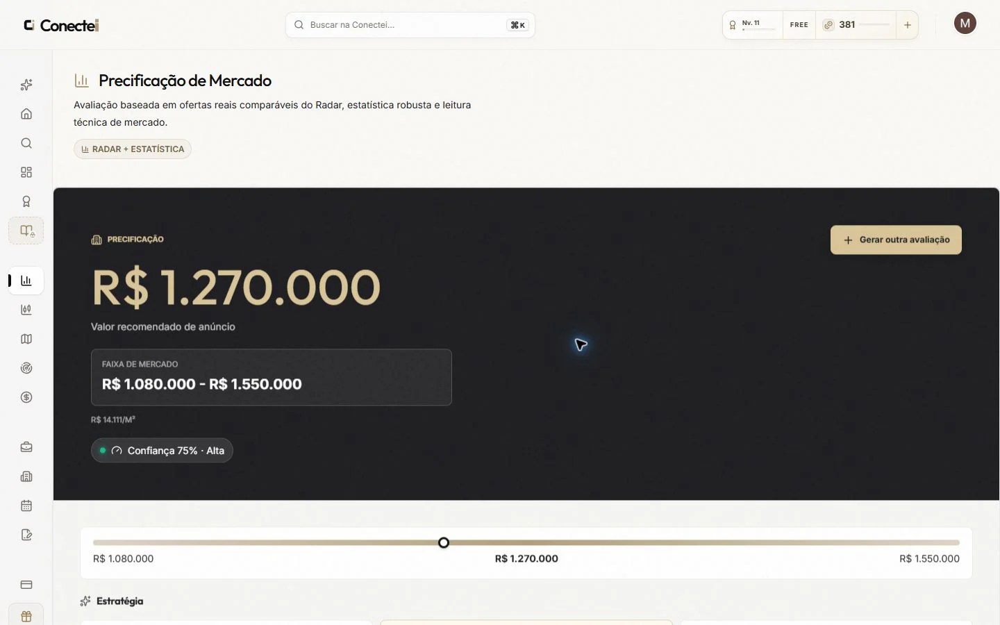
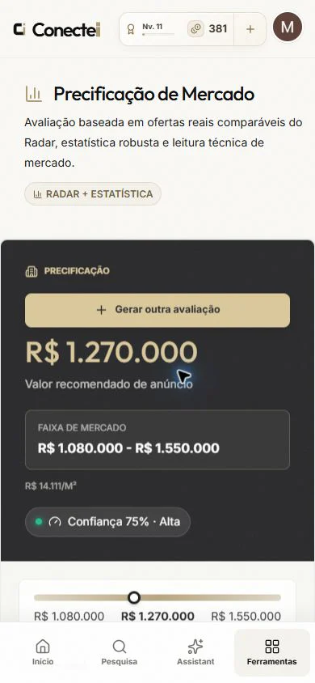

  

<h1 align="center">A operação imobiliária, conectada de ponta a ponta.</h1>

  Pesquisa, inteligência de mercado, relacionamento, carteira, documentos e presença digital 
  em um único espaço de trabalho para corretores e equipes imobiliárias.

  <a href="https://conecteimob.com.br"><strong>Conhecer a Conectei ↗</strong></a>
  &nbsp;&nbsp;·&nbsp;&nbsp;
  <a href="#mapa-completo-de-funcionalidades">Explorar funcionalidades</a>
  &nbsp;&nbsp;·&nbsp;&nbsp;
  <a href="#engenharia-do-produto">Ver engenharia</a>

  PLATAFORMA IMOBILIÁRIA &nbsp;·&nbsp; SaaS B2B &nbsp;·&nbsp; WEB + PWA &nbsp;·&nbsp; BRASIL

---

## Visão geral

A [Conectei](https://conecteimob.com.br) é uma plataforma de inteligência e operação imobiliária criada para reduzir a troca entre ferramentas e manter o próximo passo sempre visível. O produto acompanha a jornada desde a descoberta de um imóvel ou oportunidade até o relacionamento, a publicação, a documentação e a leitura do desempenho.

Ela pode ser usada por um corretor autônomo ou compartilhada por uma imobiliária, com contexto de organização, responsáveis, papéis, permissões e créditos.

<table align="center">
  <tr>
    <td align="center" width="33%">
      <strong>500K+ linhas</strong> 
      Produto, plataforma, testes e entrega
    </td>
    <td align="center" width="33%">
      <strong>1.500+ arquivos</strong> 
      Organizados por domínios de negócio
    </td>
    <td align="center" width="33%">
      <strong>Uma plataforma</strong> 
      Da pesquisa à operação comercial
    </td>
  </tr>
</table>

Snapshot do produto em produção · agosto de 2026 · dependências e arquivos gerados não incluídos

> [!IMPORTANT]
> Este README apresenta a superfície pública do produto. Fontes de dados, critérios proprietários, regras de negócio, mecanismos antifraude, contratos com fornecedores, credenciais, endpoints privados e detalhes operacionais sensíveis são intencionalmente omitidos.

## Uma jornada, não um conjunto de ferramentas soltas

Um resultado de pesquisa pode virar uma abordagem, uma oportunidade pode seguir para o CRM, um imóvel pode ganhar responsável e publicação, e os compromissos e documentos continuam no mesmo ambiente.

## O produto em uso

<table>
  <tr>
    <td width="66%">
      
    </td>
    <td width="34%">
      
    </td>
  </tr>
  <tr>
    <td>Visão integrada da operação no desktop.</td>
    <td>A mesma rotina adaptada ao celular.</td>
  </tr>
</table>

<strong>Ver mais telas do produto</strong>

 

<table>
  <tr>
    <td width="66%">
      
    </td>
    <td width="34%">
      
    </td>
  </tr>
  <tr>
    <td>Pesquisa estruturada com histórico e retomada rápida.</td>
    <td>Fluxo responsivo, sem reduzir a clareza dos campos.</td>
  </tr>
</table>

<table>
  <tr>
    <td width="66%">
      
    </td>
    <td width="34%">
      
    </td>
  </tr>
  <tr>
    <td>Faixa de mercado, valor recomendado e confiança em uma leitura direta.</td>
    <td>Relatório completo também no celular.</td>
  </tr>
</table>

## Mapa completo de funcionalidades

Os blocos abaixo documentam a superfície de produto disponível. Abra cada área para conhecer os recursos sem expor a implementação interna.

<strong>01 · Descoberta e inteligência</strong> — encontre onde vale a pena agir

| Área | O que entrega |
| --- | --- |
| **Pesquisa imobiliária** | Busca estruturada por endereço e, onde disponível, por edifício ou condomínio; histórico, pesquisas recentes, retomada e consulta de informações relacionadas ao imóvel. |
| **Mapa de imóveis** | Exploração geográfica por área visível, localização e bairro, com agrupamentos, densidade, filtros, detalhes de edifícios e transição direta para a pesquisa. |
| **Radar de Oportunidades** | Monitoramento de ofertas públicas, busca e filtros comerciais, visualização em cards ou lista, detalhes da oportunidade, salvamento e continuidade no CRM. |
| **Mercado** | Painel de indicadores econômicos e imobiliários, expectativas, leituras rápidas, notícias contextualizadas, séries históricas e alertas pessoais. |
| **Calculadoras** | Simulações de CDI, CUB-SC, IGP-M, aportes mensais e comparação de cenários, com memória dos critérios usados no cálculo. |
| **Precificação** | Jornada guiada por finalidade, localização e características; seleção de comparáveis, faixa de mercado, valor por metro quadrado, indicador de confiança, estratégias e histórico de avaliações. |
| **Análise de crédito** | Consulta para finalidade imobiliária mediante consentimento, leitura executiva de risco, fatores relevantes, score quando disponível e histórico de análises. |

<strong>02 · Relacionamento e execução comercial</strong> — transforme contexto em próxima ação

| Área | O que entrega |
| --- | --- |
| **CRM imobiliário** | Contatos, negócios, pipeline visual, etapas personalizáveis, responsáveis, prioridades, temperaturas, tags, campos personalizados e visão consolidada. |
| **Produtividade comercial** | Notas, atividades, tarefas, follow-ups, timeline, filtros salvos, detecção de duplicidade e vínculos entre contatos, negócios, imóveis e documentos. |
| **Comunicação no CRM** | Composição e histórico de e-mails, templates, acompanhamento de retornos e automações para etapas, inatividade e próximas ações. |
| **Agenda** | Visões mensal, semanal e de agenda; criação, edição, conclusão e cancelamento de compromissos, visitas e lembretes. |
| **Assistant Conectei** | Conversa por texto ou voz para consultar a operação, pesquisar, navegar, trabalhar com CRM, agenda, lembretes, Radar, mercado e desempenho. Ações sensíveis permanecem explícitas para o usuário. |
| **Busca universal** | Um único campo para encontrar imóveis, edifícios, contatos, negócios, assinaturas e pesquisas recentes, além de iniciar ações rápidas. |
| **Abordagem assistida** | Preparação de contatos via WhatsApp a partir de resultados elegíveis, com seleção de destinatários, revisão de mensagem, ritmo de envio, acompanhamento e histórico da execução. |

<strong>03 · Operação imobiliária</strong> — organize carteira, equipe e fechamento

| Área | O que entrega |
| --- | --- |
| **Carteira de imóveis** | Cadastro guiado, fotos e mídia, características, status, qualidade do anúncio, responsáveis, filtros, tabela ou cards, seleção em lote, histórico e publicação. |
| **IA para cadastro** | Sugestões de título, criação e revisão de descrição em diferentes tons e preenchimento assistido de campos, sempre sujeito à revisão antes de aplicar. |
| **Central da operação** | Indicadores de imóveis, visualizações, leads e equipe, além de pendências de publicação, atendimento e cadastros incompletos. |
| **Equipes e organizações** | Convites, papéis, permissões, responsáveis, visibilidade por escopo, saldo compartilhado e orçamento de créditos por integrante. |
| **Assinaturas eletrônicas** | Envio de PDF, definição e ordenação de signatários, ambiente seguro de assinatura, status, lembretes, links, documentos concluídos e histórico. |
| **Planos e créditos** | Catálogo de planos, checkout, mudança ou cancelamento, cobrança mensal ou anual, histórico financeiro, saldo e custo informado antes de ações que usam créditos. |
| **Perfil e preferências** | Dados pessoais e profissionais, segurança, notificações, comunicações operacionais e preferências da conta. |

<strong>04 · Presença digital e geração de demanda</strong> — publique, receba e entenda o interesse

| Área | O que entrega |
| --- | --- |
| **Site imobiliário próprio** | Editor de marca, cores, tipografia, hero, conteúdo institucional, catálogo, equipe, contato, redes sociais, localização, imagens e endereço público personalizado. |
| **Catálogo público** | Busca, filtros, ordenação, imóveis em destaque, páginas individuais, CTAs de WhatsApp e e-mail e experiência responsiva. |
| **Assistant no site** | Assistente voltado exclusivamente ao catálogo publicado para ajudar visitantes a encontrar imóveis compatíveis com sua intenção. |
| **Leads e distribuição** | Formulários e conversas convertidos em demanda comercial, com responsável do imóvel, regras de distribuição e acompanhamento de pendências. |
| **SEO e compartilhamento** | Títulos, descrições, imagem social, sitemap, dados estruturados, renderização indexável e prévia antes da publicação. |
| **Analytics imobiliário** | Visualizações, leads, conversão, interações com IA, imóveis com melhor desempenho, origem da demanda, intenção dos visitantes e leitura por corretor. |
| **Avaliações e conteúdo público** | Páginas de avaliações, guias editoriais, páginas de recursos e presença pública preparada para busca e compartilhamento. |

<strong>05 · Rotina, engajamento e suporte</strong> — mantenha a operação em movimento

| Área | O que entrega |
| --- | --- |
| **Início inteligente** | Prioridades comerciais, pulso de mercado, progresso, saldo, atalhos, atividades recentes e retomada do ponto em que o trabalho parou. |
| **Desempenho** | Métricas de pesquisa, proprietários, unidades, precificações e carteira; gráficos de atividade, funil, qualidade, rankings e comparações por período. |
| **Notificações** | Central interna, não lidas, lembretes, preferências por categoria, Web Push e avisos relevantes mesmo fora da aba. |
| **Progresso e gamificação** | Níveis, XP, sequência de uso, missões, desafios, conquistas, ranking, giros e recompensas vinculadas a ações reais no produto. |
| **Indique e Ganhe** | Link pessoal, compartilhamento rápido, benefício para o convidado, acompanhamento da jornada e histórico de recompensas. |
| **PWA instalável** | Uso em celular e desktop com aparência de aplicativo, atalhos, atualização controlada, estado de conexão e navegação responsiva. |
| **Suporte e feedback** | Ajuda dentro do produto, conversa contextual e fluxo estruturado para relatar sugestões ou problemas sem sair da rotina. |

## Integrações que aparecem para o usuário

<table>
  <tr>
    <td width="33%" valign="top">
      <strong>🔐 Acesso</strong>  
      Login por Google, Facebook ou link seguro por e-mail, onboarding profissional e convites de equipe.
    </td>
    <td width="33%" valign="top">
      <strong>💬 Comunicação</strong>  
      WhatsApp, e-mail transacional e comercial, notificações internas e Web Push.
    </td>
    <td width="33%" valign="top">
      <strong>🗺️ Localização</strong>  
      Mapas, geolocalização, agrupamentos e exploração visual do território.
    </td>
  </tr>
  <tr>
    <td width="33%" valign="top">
      <strong>✍️ Documentos</strong>  
      Assinatura eletrônica incorporada, atualizações de status, lembretes e documentos concluídos.
    </td>
    <td width="33%" valign="top">
      <strong>💳 Pagamentos</strong>  
      Checkout, assinatura recorrente, planos anuais, histórico e ciclo de cobrança.
    </td>
    <td width="33%" valign="top">
      <strong>✨ Inteligência artificial</strong>  
      Assistência por texto e voz, análise contextual, sugestões de conteúdo e automações especializadas.
    </td>
  </tr>
</table>

Os provedores, contratos, credenciais e detalhes de integração ficam atrás de fronteiras privadas. O README descreve somente a experiência entregue e as categorias de serviço conectadas.

## Facilidades pensadas para o trabalho real

| Menos atrito | Mais controle | Continuidade |
| --- | --- | --- |
| Interface responsiva em desktop e mobile | Custos em créditos exibidos antes da confirmação | Histórico e itens recentes em áreas-chave |
| Autosave em fluxos longos | Papéis, permissões e responsáveis | Contexto preservado entre ferramentas |
| Atalhos e busca universal | Confirmação antes de ações sensíveis | Notificações e lembretes acionáveis |
| Prévia antes de publicar | Rascunhos separados da versão pública | Instalação como aplicativo |
| Sugestões de IA revisáveis | Trilhas de status e auditoria | Estados vazios, carregamento e recuperação de erro |
| Cards, tabelas, listas e mapas conforme a tarefa | Preferências por usuário e organização | Acessibilidade e navegação por teclado |

## Engenharia do produto

A Conectei foi construída como um produto único com superfícies públicas, autenticadas e operacionais coordenadas. A arquitetura detalhada é privada; este é o recorte seguro do que sustenta a experiência.

| Camada | Tecnologias e práticas |
| --- | --- |
| **Interface** | React 19, Vite 8, design responsivo, Framer Motion, Lucide e componentes acessíveis |
| **Visualização** | Recharts, mapas interativos, dashboards e relatórios adaptáveis |
| **Aplicação** | Node.js, funções serverless, validação de contratos e processamento assíncrono |
| **Dados** | PostgreSQL, migrações versionadas e isolamento por organização |
| **Entrega pública** | Renderização pública, prerenderização, SEO técnico, PWA e distribuição global |
| **Qualidade** | Testes unitários, integração com banco, fluxos completos e auditorias visuais com Playwright |
| **Operação** | Logs estruturados, health checks, alertas, jobs monitorados e ferramentas internas de suporte |

<strong>Qualidade, segurança e privacidade por padrão</strong>

- Separação entre áreas públicas, produto autenticado e operações privilegiadas.
- Contexto de organização e autorização aplicado aos recursos compartilhados.
- Validação de entrada, proteção contra abuso e controles de sessão e origem.
- Minimização de dados em fluxos assistidos por IA e confirmação para ações de impacto.
- Notificações, documentos, créditos e automações tratados com idempotência e rastreabilidade.
- Testes de regressão para privacidade, permissões, concorrência e fronteiras entre usuários.
- Observabilidade com sanitização, agrupamento de falhas e trilha de ações administrativas.

## Escopo deste repositório

Este é um produto proprietário em operação. Por isso, o README funciona como uma apresentação do produto e da capacidade de engenharia — não como documentação de instalação, catálogo de APIs ou descrição da estratégia de dados.

O projeto representa trabalho de ponta a ponta em produto, experiência, aplicação, dados, automação, qualidade e operação.

---

  <picture>
    <source media="(prefers-color-scheme: dark)" srcset="./assets/conectei-logo-dark.svg">
    
  </picture>

  <a href="https://conecteimob.com.br">conecteimob.com.br</a>
  &nbsp;&nbsp;·&nbsp;&nbsp;
  <a href="https://github.com/miguelzacca">github.com/miguelzacca</a>

