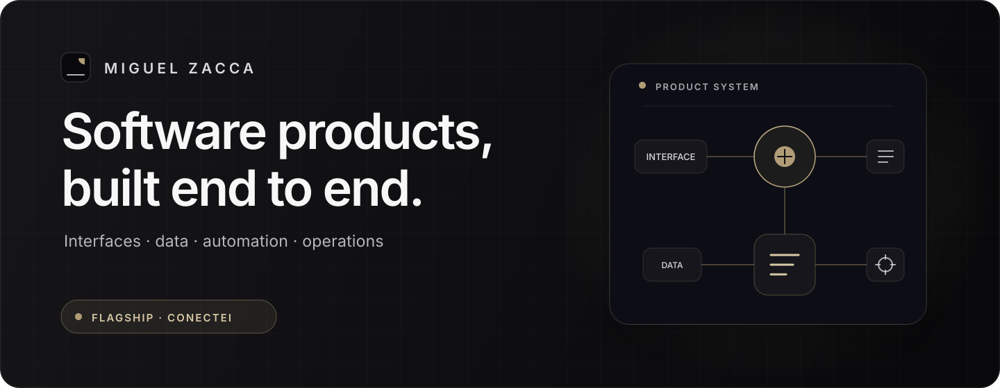
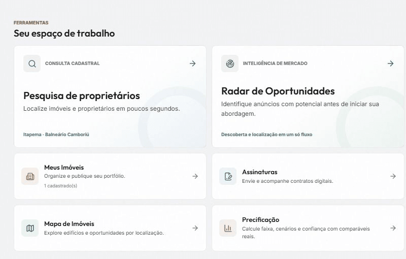
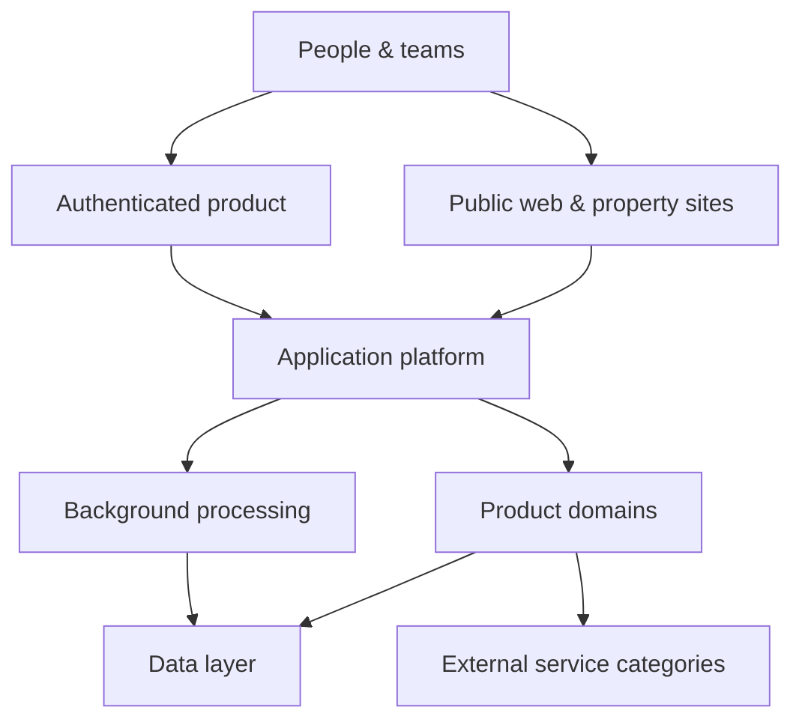
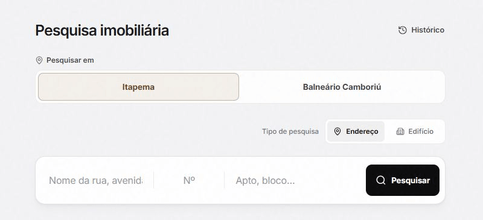
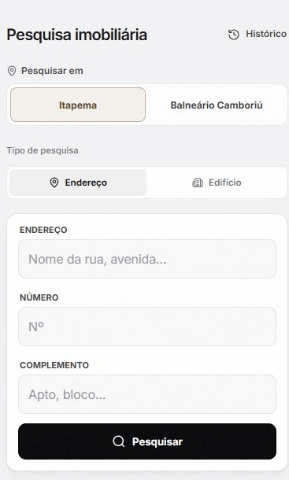

  

  <a href="https://github.com/miguelzacca">GitHub</a>
  &nbsp;&middot;&nbsp;
  <a href="https://conecteimob.com.br">Conectei</a>

## I build software as a product

I work across product design, application engineering, data and operations. My focus is taking broad product problems from interface and architecture through automation, quality gates and production tooling.

The project that best represents that work is **Conectei**.

## Conectei

[Conectei](https://conecteimob.com.br) is a real-estate operations platform built for professionals and teams in Brazil. It brings property workflows, CRM, organizations, public websites, automation, billing and decision support into one product.

Building it has meant treating the interface, data, security, search visibility, integrations, background work and day-to-day operation as parts of the same system.

<table align="center">
  <tr>
    <td align="center" width="50%">
      <strong>500K+ effective LOC</strong> 
      Product, platform, tests, styles and delivery tooling
    </td>
    <td align="center" width="50%">
      <strong>150+ SQL tables</strong> 
      A data model built for real-world operations
    </td>
  </tr>
</table>

Production codebase snapshot · August 2026 · dependencies and generated output excluded

  

Authenticated workspace · demonstration data

### Product at a glance

| Area                      | What it covers                                                                       |
| ------------------------- | ------------------------------------------------------------------------------------ |
| Property operations       | Research, organize, evaluate and publish property portfolios.                        |
| CRM & commercial workflow | Leads, relationships, follow-up, pipeline and calendar in one workspace.             |
| Organizations & teams     | Shared product context for multi-user real-estate operations.                        |
| Public websites           | Branded storefronts and property pages designed for search and mobile.               |
| Decision workflows        | Opportunity discovery, valuation support and AI-assisted work.                       |
| Platform operations       | Subscriptions, documents, notifications, automation, support tooling and monitoring. |

The source code, data strategy and internal architecture are private. The description here is intentionally limited to the product surface and public-safe engineering boundaries.

## Engineering at a glance

Conectei is one product with distinct public, authenticated and operational surfaces. The diagram shows the durable system boundaries without exposing providers, private APIs or proprietary workflows.

| Engineering concern  | Public-safe view                                                                                           |
| -------------------- | ---------------------------------------------------------------------------------------------------------- |
| Product architecture | Public web, authenticated workspace and internal operations built as coordinated surfaces.                 |
| SaaS boundaries      | Organization-aware product context, authorization and separation of privileged operations.                 |
| Web delivery         | Interactive application UI, server-rendered public surfaces, build-time prerendering and PWA support.      |
| Data & automation    | PostgreSQL-backed workflows, background processing and external integrations behind controlled boundaries. |
| Applied AI           | AI-assisted product workflows integrated where they reduce operational work.                               |
| Quality              | Unit, integration, database-backed and browser tests, plus lint, build and SEO validation.                 |
| Operations           | Structured logging, health visibility and internal support tooling designed with auditability in mind.     |

### Core stack

| Layer               | Technology                                          |
| ------------------- | --------------------------------------------------- |
| Product UI          | React · Vite                                        |
| Application runtime | Node.js · Vercel Functions                          |
| Data                | PostgreSQL                                          |
| Public delivery     | Server rendering · build-time prerendering · Vercel |
| Quality             | Node.js test runner · Playwright · Oxlint           |

## Product surfaces

The same workflow is designed to remain clear across desktop and mobile. These images use demonstration data and omit administrative, provider and operational screens.

<table>
  <tr>
    <td width="66%">
      
    </td>
    <td width="34%">
      
    </td>
  </tr>
  <tr>
    <td>Structured property research on desktop.</td>
    <td>The same workflow on mobile.</td>
  </tr>
</table>

## What I care about

- Product interfaces that make complex work feel clear.
- Architecture that supports the product without becoming the product.
- Data and automation with explicit operational boundaries.
- Security, observability and testing as everyday engineering work.
- Shipping across the full path from first interaction to production operation.

  <a href="https://github.com/miguelzacca">github.com/miguelzacca</a>
  &nbsp;&middot;&nbsp;
  <a href="https://conecteimob.com.br">conecteimob.com.br</a>

