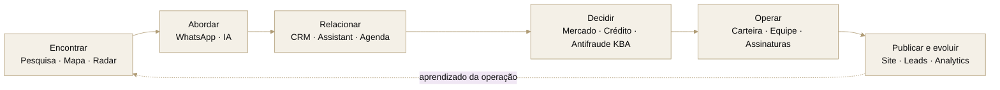

  

<h1 align="center">A operação imobiliária, conectada de ponta a ponta.</h1>

  Pesquisa, campanhas de WhatsApp com IA, relacionamento, verificação de identidade e presença digital 
  em um único espaço de trabalho para corretores e equipes imobiliárias.

  <a href="https://conecteimob.com.br"><strong>Conhecer a Conectei ↗</strong></a>
  &nbsp;&nbsp;·&nbsp;&nbsp;
  <a href="#mapa-completo-de-funcionalidades">Explorar funcionalidades</a>
  &nbsp;&nbsp;·&nbsp;&nbsp;
  <a href="#engenharia-do-produto">Ver engenharia</a>

  PLATAFORMA IMOBILIÁRIA &nbsp;·&nbsp; SaaS B2B &nbsp;·&nbsp; WEB + PWA &nbsp;·&nbsp; BRASIL

---

## Visão geral

A [Conectei](https://conecteimob.com.br) é uma plataforma de inteligência e operação imobiliária criada para reduzir a troca entre ferramentas e manter o próximo passo sempre visível. O produto acompanha a jornada desde a descoberta de um imóvel ou oportunidade até a abordagem do proprietário, o relacionamento, a análise, a documentação, a publicação e a leitura do desempenho.

Ela pode ser usada por um corretor autônomo ou compartilhada por uma imobiliária, com contexto de organização, responsáveis, papéis, permissões, créditos e fluxos que atravessam pesquisa, CRM, carteira, documentos e presença digital.

<table align="center">
  <tr>
    <td align="center" width="33%">
      <strong>700K+ linhas efetivas</strong> 
      Produto, plataforma, testes e entrega
    </td>
    <td align="center" width="33%">
      <strong>1.700+ arquivos</strong> 
      Organizados por domínios de negócio
    </td>
    <td align="center" width="33%">
      <strong>Uma plataforma</strong> 
      Da descoberta ao fechamento e à publicação
    </td>
  </tr>
</table>

Snapshot do produto em produção · setembro de 2026 · dependências e arquivos gerados não incluídos

> [!IMPORTANT]
> Este README apresenta a superfície pública do produto. Fontes de dados, critérios proprietários, regras de negócio, mecanismos antifraude, contratos com fornecedores, credenciais, endpoints privados e detalhes operacionais sensíveis são intencionalmente omitidos.

## Uma jornada, não um conjunto de ferramentas soltas

Um resultado de pesquisa pode virar uma campanha de WhatsApp revisada pelo profissional, uma resposta pode seguir para o CRM, uma negociação pode receber uma verificação KBA e o imóvel pode avançar para carteira, documentos e publicação no mesmo ambiente.

## O produto em uso

<table>
  <tr>
    <td width="66%">
      
    </td>
    <td width="34%">
      
    </td>
  </tr>
  <tr>
    <td>Visão integrada da operação no desktop.</td>
    <td>A mesma rotina adaptada ao celular.</td>
  </tr>
</table>

<table>
  <tr>
    <td width="66%">
      
    </td>
    <td width="34%">
      
    </td>
  </tr>
  <tr>
    <td>Pesquisa estruturada com histórico e retomada rápida.</td>
    <td>Fluxo responsivo, sem reduzir a clareza dos campos.</td>
  </tr>
</table>

<table>
  <tr>
    <td width="66%">
      
    </td>
    <td width="34%">
      
    </td>
  </tr>
  <tr>
    <td>Faixa de mercado, valor recomendado e confiança em uma leitura direta.</td>
    <td>Relatório completo também no celular.</td>
  </tr>
</table>

## Mapa completo de funcionalidades

Os blocos abaixo documentam a superfície de produto disponível. Todo o conteúdo fica visível diretamente no README, sem seções recolhidas.

### 01 · Descoberta e inteligência — encontre onde vale a pena agir

| Área                       | O que entrega                                                                                                                                                                                    |
| -------------------------- | ------------------------------------------------------------------------------------------------------------------------------------------------------------------------------------------------ |
| **Pesquisa imobiliária**   | Busca estruturada por endereço e, onde disponível, por edifício ou condomínio; histórico, pesquisas recentes, retomada e consulta de informações relacionadas ao imóvel.                         |
| **Mapa de imóveis**        | Exploração geográfica por área visível, localização e bairro, com agrupamentos, densidade, filtros, detalhes de edifícios e transição direta para a pesquisa.                                    |
| **Radar de Oportunidades** | Monitoramento de ofertas públicas, busca e filtros comerciais, visualização em cards ou lista, detalhes da oportunidade, salvamento e continuidade no CRM.                                       |
| **Mercado**                | Painel de indicadores econômicos e imobiliários, expectativas, leituras rápidas, notícias contextualizadas, séries históricas e alertas pessoais.                                                |
| **Calculadoras**           | Simulações de CDI, CUB-SC, IGP-M, aportes mensais e comparação de cenários, com memória dos critérios usados no cálculo.                                                                         |
| **Precificação**           | Jornada guiada por finalidade, localização e características; seleção de comparáveis, faixa de mercado, valor por metro quadrado, indicador de confiança, estratégias e histórico de avaliações. |
| **Análise de crédito**     | Consulta para finalidade imobiliária mediante consentimento, leitura executiva de risco, fatores relevantes, score quando disponível e histórico de análises.                                    |

### 02 · Relacionamento e execução comercial — transforme contexto em próxima ação

| Área                        | O que entrega                                                                                                                                                                                                         |
| --------------------------- | --------------------------------------------------------------------------------------------------------------------------------------------------------------------------------------------------------------------- |
| **CRM imobiliário**         | Contatos, negócios, pipeline visual, etapas personalizáveis, responsáveis, prioridades, temperaturas, tags, campos personalizados e visão consolidada.                                                                |
| **Produtividade comercial** | Notas, atividades, tarefas, follow-ups, timeline, filtros salvos, detecção de duplicidade e vínculos entre contatos, negócios, imóveis e documentos.                                                                  |
| **Comunicação no CRM**      | Composição e histórico de e-mails, templates, acompanhamento de retornos e automações para etapas, inatividade e próximas ações.                                                                                      |
| **Agenda**                  | Visões mensal, semanal e de agenda; criação, edição, conclusão e cancelamento de compromissos, visitas e lembretes.                                                                                                   |
| **Assistant Conectei**      | Conversa por texto ou voz para consultar a operação, pesquisar, navegar, trabalhar com CRM, agenda, lembretes, Radar, mercado e desempenho. Ações sensíveis permanecem explícitas para o usuário.                     |
| **Busca universal**         | Um único campo para encontrar imóveis, edifícios, contatos, negócios, assinaturas, verificações e pesquisas recentes, além de iniciar ações rápidas.                                                                  |
| **Campanhas de WhatsApp**   | Seleção de proprietários e telefones elegíveis, mensagem fixa ou variações preparadas por IA, revisão da fila, conexão temporária, ritmo com intervalos e pausas, execução sequencial e acompanhamento de resultados. |

As campanhas de WhatsApp foram desenhadas para reduzir o trabalho repetitivo de abrir proprietário por proprietário e preparar cada abordagem manualmente. O corretor escolhe quem abordar, revisa a configuração e mantém o controle sobre a execução; a IA pode preparar variações de mensagem antes do envio.

### 03 · Operação imobiliária — organize carteira, equipe, segurança e fechamento

| Área                        | O que entrega                                                                                                                                                                                            |
| --------------------------- | -------------------------------------------------------------------------------------------------------------------------------------------------------------------------------------------------------- |
| **Carteira de imóveis**     | Cadastro guiado, fotos e mídia, características, status, qualidade do anúncio, responsáveis, filtros, tabela ou cards, seleção em lote, histórico e publicação.                                          |
| **IA para cadastro**        | Sugestões de título, criação e revisão de descrição em diferentes tons e preenchimento assistido de campos, sempre sujeito à revisão antes de aplicar.                                                   |
| **Central da operação**     | Indicadores de imóveis, visualizações, leads e equipe, além de pendências de publicação, atendimento e cadastros incompletos.                                                                            |
| **Equipes e organizações**  | Convites, papéis, permissões, responsáveis, visibilidade por escopo, saldo compartilhado e orçamento de créditos por integrante.                                                                         |
| **Assinaturas eletrônicas** | Envio de PDF, definição e ordenação de signatários, ambiente seguro de assinatura, status, lembretes, links, documentos concluídos e histórico.                                                          |
| **Antifraude KBA**          | Verificação de identidade por CPF com questionário KBA, link temporário para resposta sem conta e resumo de acertos, percentual e veredito como sinal adicional. Cada novo questionário custa 1 crédito. |
| **Planos e créditos**       | Catálogo de planos, checkout, mudança ou cancelamento, cobrança mensal ou anual, histórico financeiro, saldo e custo informado antes de ações que usam créditos.                                         |
| **Perfil e preferências**   | Dados pessoais e profissionais, segurança, notificações, comunicações operacionais e preferências da conta.                                                                                              |

O Antifraude usa KBA (Knowledge-Based Authentication) como uma camada adicional de verificação de identidade em negociações que pedem mais segurança, como locações e operações realizadas à distância. Ele não é apresentado como garantia absoluta de identidade: o resultado funciona como mais um sinal para a decisão do profissional.

### 04 · Presença digital e geração de demanda — publique, receba e entenda o interesse

| Área                                   | O que entrega                                                                                                                                                                                                                     |
| -------------------------------------- | --------------------------------------------------------------------------------------------------------------------------------------------------------------------------------------------------------------------------------- |
| **Site imobiliário próprio**           | Editor de marca, cores, tipografia, hero, conteúdo institucional, catálogo, equipe, contato, redes sociais, localização, imagens e endereço público personalizado.                                                                |
| **Catálogo público**                   | Busca, filtros, ordenação, imóveis em destaque, páginas individuais, CTAs de WhatsApp e e-mail e experiência responsiva.                                                                                                          |
| **Sites por subdomínio/domínio**       | Vitrines públicas por identidade própria, com hostname principal, canonical e isolamento do catálogo; suporte a subdomínios da plataforma e domínios personalizados quando configurados.                                         |
| **Assistant no site**                  | Assistente voltado exclusivamente ao catálogo publicado para ajudar visitantes a encontrar imóveis compatíveis com sua intenção.                                                                                                  |
| **Leads e distribuição**               | Formulários e conversas convertidos em demanda comercial, com responsável do imóvel, regras de distribuição e acompanhamento de pendências.                                                                                       |
| **SEO, AEO e descoberta por agentes**  | Renderização indexável, metadata, canonical, sitemap, dados estruturados, páginas editoriais, Markdown alternativo, `llms.txt`, instruções para agentes e controles de crawling; conteúdo público e produto permanecem sincronizados. |
| **Indexação e compartilhamento**       | Imagens sociais, páginas indexáveis somente quando atingem critérios mínimos de qualidade e notificações de atualização por mecanismos compatíveis.                                                                              |
| **Analytics imobiliário**              | Visualizações, leads, conversão, interações com IA, imóveis com melhor desempenho, origem da demanda, intenção dos visitantes e leitura por corretor.                                                                             |
| **Avaliações e conteúdo público**      | Páginas de avaliações, guias editoriais, páginas de recursos e presença pública preparada para busca e compartilhamento.                                                                                                          |

### 05 · Rotina, engajamento e suporte — mantenha a operação em movimento

| Área                        | O que entrega                                                                                                                                         |
| --------------------------- | ----------------------------------------------------------------------------------------------------------------------------------------------------- |
| **Início inteligente**      | Prioridades comerciais, pulso de mercado, progresso, saldo, atalhos, atividades recentes e retomada do ponto em que o trabalho parou.                 |
| **Desempenho**              | Métricas de pesquisa, proprietários, unidades, precificações e carteira; gráficos de atividade, funil, qualidade, rankings e comparações por período. |
| **Notificações**            | Central interna, não lidas, lembretes, preferências por categoria, Web Push e avisos relevantes mesmo fora da aba.                                    |
| **Progresso e gamificação** | Níveis, XP, sequência de uso, missões, desafios, conquistas, ranking, giros e recompensas vinculadas a ações reais no produto.                        |
| **Indique e Ganhe**         | Link pessoal, compartilhamento rápido, benefício para o convidado, acompanhamento da jornada e histórico de recompensas.                              |
| **PWA instalável**          | Uso em celular e desktop com aparência de aplicativo, atalhos, atualização controlada, estado de conexão e navegação responsiva.                      |
| **Suporte e feedback**      | Ajuda dentro do produto, conversa contextual e fluxo estruturado para relatar sugestões ou problemas sem sair da rotina.                              |

## Integrações que aparecem para o usuário

<table>
  <tr>
    <td width="33%" valign="top">
      <strong>🔐 Acesso</strong>  
      Login por Google, Facebook ou link seguro por e-mail, onboarding profissional e convites de equipe.
    </td>
    <td width="33%" valign="top">
      <strong>💬 Comunicação</strong>  
      Campanhas de WhatsApp, e-mail transacional e comercial, notificações internas e Web Push.
    </td>
    <td width="33%" valign="top">
      <strong>🗺️ Localização</strong>  
      Mapas, geolocalização, agrupamentos e exploração visual do território.
    </td>
  </tr>
  <tr>
    <td width="33%" valign="top">
      <strong>✍️ Documentos e identidade</strong>  
      Assinatura eletrônica, verificação KBA, links públicos temporários, atualizações de status e documentos concluídos.
    </td>
    <td width="33%" valign="top">
      <strong>💳 Pagamentos</strong>  
      Checkout, assinatura recorrente, planos anuais, histórico, créditos e ciclo de cobrança.
    </td>
    <td width="33%" valign="top">
      <strong>✨ Inteligência artificial</strong>  
      Assistência por texto e voz, análise contextual, sugestões de conteúdo, personalização de mensagens e automações especializadas.
    </td>
  </tr>
</table>

Os provedores, contratos, credenciais e detalhes de integração ficam atrás de fronteiras privadas. O README descreve somente a experiência entregue e as categorias de serviço conectadas.

## Repositórios e serviços relacionados

A Conectei é o produto principal, mas algumas capacidades ficam em serviços e projetos auxiliares com ciclos de entrega próprios. A separação reduz acoplamento operacional e permite evoluir componentes específicos sem transformar o README público em documentação de infraestrutura privada.

| Repositório / serviço | Papel no ecossistema |
| --------------------- | -------------------- |
| **`conecteimob/conecteimob`** | Aplicação principal: produto web/PWA, APIs, domínio de negócio, sites públicos, CRM, imóveis, crédito, assinaturas, antifraude, SEO e operação. |
| **`conecteimob/evo`** | Runtime dedicado à conectividade de WhatsApp usada pelas campanhas. Empacota a Evolution API em imagem própria e mantém compatibilidade da camada de sessão/pareamento necessária ao fluxo da Conectei. |
| **`conecteimob/mailer`** | Serviço auxiliar de e-mail e APIs de suporte. No produto principal, a entrega transacional é consumida por uma fronteira HTTP separada para fluxos como acesso por link e notificações de assinatura. |
| **`conecteimob/task`** | Microapp/PWA de lembretes e tarefas do ecossistema, mantido separado do produto principal e com persistência local no navegador. |

O repositório `task` mantém uma implementação pequena e independente; `evo` e `mailer` representam serviços auxiliares com responsabilidades mais específicas. Nem todo repositório listado é uma dependência obrigatória do mesmo runtime ou possui o mesmo ciclo de release da aplicação principal.

## Facilidades pensadas para o trabalho real

| Menos atrito                                     | Mais controle                                    | Continuidade                                       |
| ------------------------------------------------ | ------------------------------------------------ | -------------------------------------------------- |
| Interface responsiva em desktop e mobile         | Custos em créditos exibidos antes da confirmação | Histórico e itens recentes em áreas-chave          |
| Autosave em fluxos longos                        | Papéis, permissões e responsáveis                | Contexto preservado entre ferramentas              |
| Campanhas em lote para proprietários             | Revisão antes de iniciar abordagem               | Resultados e estado da campanha preservados        |
| Atalhos e busca universal                        | Confirmação antes de ações sensíveis             | Notificações e lembretes acionáveis                |
| Prévia antes de publicar                         | Rascunhos separados da versão pública            | Instalação como aplicativo                         |
| Sugestões de IA revisáveis                       | Trilhas de status e auditoria                    | Estados vazios, carregamento e recuperação de erro |
| Cards, tabelas, listas e mapas conforme a tarefa | Preferências por usuário e organização           | Acessibilidade e navegação por teclado             |

## Engenharia do produto

A Conectei foi construída como um produto único com superfícies públicas, autenticadas e operacionais coordenadas. A arquitetura detalhada é privada; este é o recorte seguro do que sustenta a experiência.

| Camada              | Tecnologias e práticas                                                                                                     |
| ------------------- | -------------------------------------------------------------------------------------------------------------------------- |
| **Interface**       | React 19, Vite 8, design responsivo, Framer Motion, Lucide e componentes acessíveis                                        |
| **Visualização**    | Recharts, mapas interativos, dashboards e relatórios adaptáveis                                                            |
| **Aplicação**       | Node.js, funções serverless, contratos de aplicação, validação de entrada e processamento assíncrono                      |
| **Dados**           | PostgreSQL, migrações versionadas, transações, idempotência e isolamento por organização                                   |
| **Comunicação**     | Serviço de e-mail separado e runtime dedicado para campanhas de WhatsApp                                                   |
| **Entrega pública** | Renderização pública, prerenderização, SEO técnico, AEO/GEO, Markdown para agentes, PWA e distribuição global              |
| **Qualidade**       | Testes unitários, integração com banco, fluxos completos, regressões de segurança e auditorias visuais com Playwright      |
| **Operação**        | Logs estruturados, observabilidade, health checks, alertas, jobs monitorados e ferramentas internas de suporte             |

### Qualidade, segurança e privacidade por padrão

- Separação entre áreas públicas, produto autenticado e operações privilegiadas.
- Contexto de organização e autorização aplicado aos recursos compartilhados.
- Validação de entrada, proteção contra abuso e controles de sessão, origem e rate limiting.
- Queries parametrizadas e contratos estritos nos fluxos de dados do produto.
- Escape contextual e políticas de segurança nas superfícies públicas geradas pelo servidor.
- Minimização de dados em fluxos assistidos por IA e confirmação para ações de impacto.
- Links públicos sensíveis com escopo, expiração e respostas minimizadas quando aplicável.
- Notificações, documentos, créditos e automações tratados com idempotência e rastreabilidade.
- Testes de regressão para privacidade, permissões, concorrência e fronteiras entre usuários.
- Observabilidade com sanitização, agrupamento de falhas e trilha de ações administrativas.

## Escopo deste repositório

Este repositório é o perfil público e a apresentação consolidada do trabalho por trás da Conectei. O produto principal é proprietário e está em operação; por isso, este README apresenta a capacidade de produto e engenharia sem funcionar como documentação de instalação, catálogo de APIs ou descrição de estratégia de dados.

A superfície apresentada aqui representa trabalho de ponta a ponta em produto, experiência, aplicação, dados, automação, IA, segurança, qualidade, SEO e operação.

---

  <strong>POR TRÁS DA CONECTEI</strong>

<h2 align="center">Não é só código. É produto de ponta a ponta.</h2>

  Conheça a visão, o processo e a engenharia por trás da plataforma — 
  da estratégia e experiência à entrega, aos dados, à IA e à operação.

 

  

<h3 align="center">
  <a href="https://miguelzacca.dev">EXPLORAR O PORTFÓLIO PROFISSIONAL ↗</a>
</h3>

  <strong>miguelzacca.dev</strong> 
  PRODUCT ENGINEER &nbsp;·&nbsp; CREATOR OF CONECTEI

 

  <a href="https://conecteimob.com.br">Conectei</a>
  &nbsp;&nbsp;·&nbsp;&nbsp;
  <a href="https://github.com/conecteimob">github.com/conecteimob</a>

