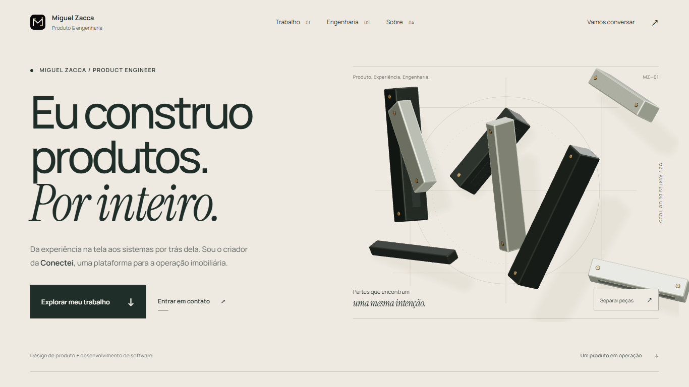
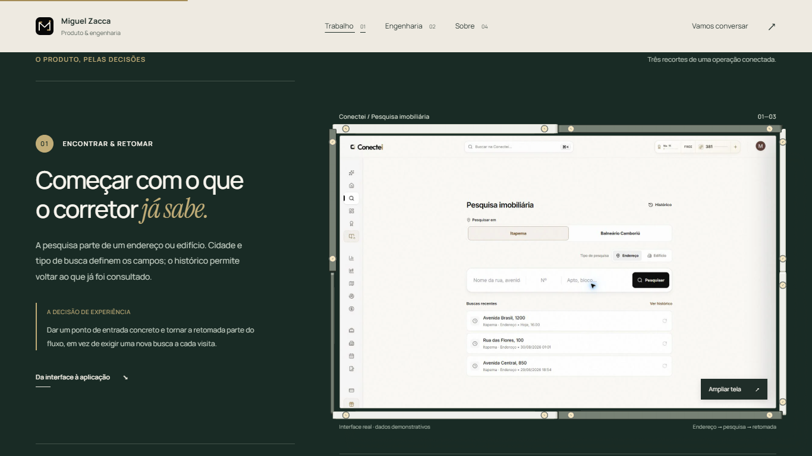
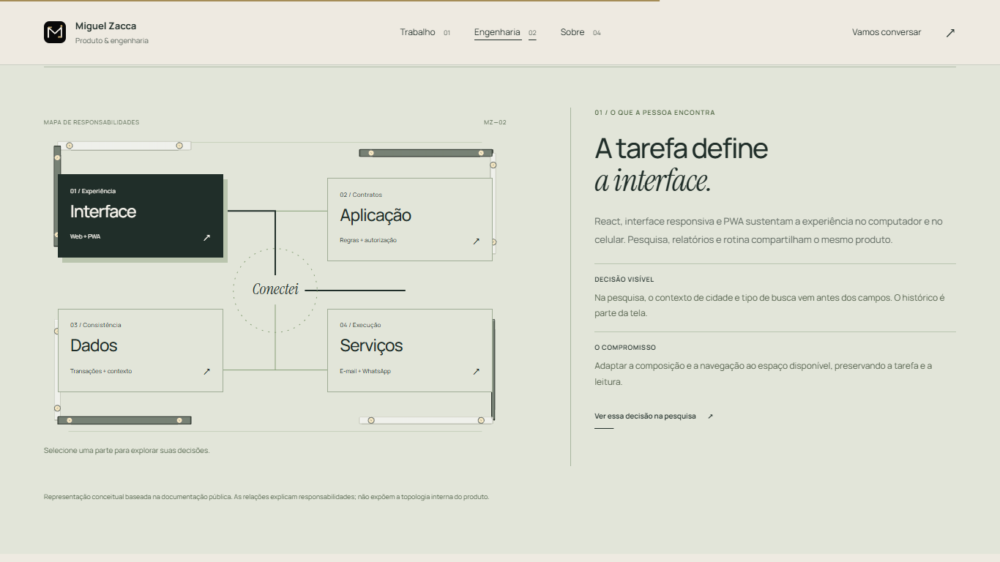

# Recortes para revisão do PR

Capturas locais da reconstrução, em 1366 × 768, Chromium 153. A interface da Conectei é um asset existente com dados demonstrativos. Não são capturas de contas de clientes.

Esses recortes mostram estados da composição. A matriz completa de antes/depois e os vídeos ficam preservados localmente em `.tmp-redesign`. Consulte [validação](../VALIDATION.md) e [direção de arte](../ART_DIRECTION.md) para reproduzir a experiência, os movimentos e os testes.
